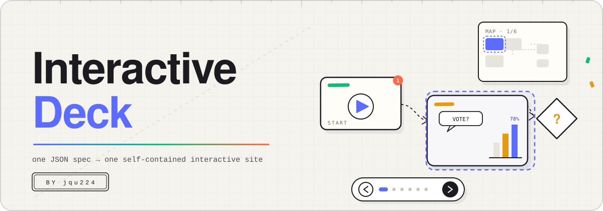

<div align="center"></div>

<div align="center">
<pre>~/interactive-deck (main*)  2 decks · 11 nodes · 4 polls · dist = single-file HTML</pre>
</div>

<div align="center">

[](./README.md)
[](./README.zh-CN.md)

</div>

## interactive-deck

**更完整、可互动、带权限管控的 HTML 个人 Deck 平台**
— 一份 JSON 规格构建一个自包含站点：实时编辑、现场演示、举手投票。

[](scripts/build.mjs)
[](src/)
[](decks/)
[](docs/realtime-plan.md)
[](https://nodejs.org/)

Deck 是流程画布：每一页是画布上的一个节点，边承载路线，镜头带着方向感沿流程行进。

## 快速上手

| | |
| --- | --- |
| **读** | [decks/01-internal-beta-review.json](decks/01-internal-beta-review.json) — 一整个 deck 就是一份 JSON 规格 |
| **跑** | `node scripts/build.mjs && npx --yes serve dist -l 5173` |
| **产物** | `dist/<slug>/index.html` — 每个 deck 一个自包含文件，任意静态托管可发 |

---

## 定位

| 层 | 在这里意味着 |
| --- | --- |
| **创作** | deck 就是 `decks/*.json`；Codex / Workbody / Claude Code 等智能体与人读写同一份规格 |
| **构建** | 一条命令把 CSS + JS + 规格内联成每个 deck 一个 HTML 文件，外加站点入口页 |
| **导航** | 指向性的前进 / 后退，键盘 + 底部按钮 + 进度点，`#节点` 深链，分叉边带路线标签（「通过」/「只要结论」） |
| **方位** | 右上角缩略图：节点方框、实时连线、虚线摄像机视口、投票 / 编辑标记，点击任意节点直达 |
| **演示** | Host 在画面停留时就地编辑；实时角色按 ≤ 50 人规模设计（[设计文档](docs/realtime-plan.md)） |
| **互动** | 选项投票带动画比例条；1–5 星评分同时给出平均分与中位数 |
| **管控** | Host / 协作者 / 观众分级；飞书多维表格、明道云、Workbody 文档表格等数据源接入同一房间 |

## 流水线

```text
 decks/*.json ──► scripts/build.mjs ──► dist/<slug>/index.html ──► 任意静态托管
     ▲    ▲                 │
     │    │                 ▼
     │    └─ 智能体写同一     npx serve dist -l 5173（本地预览）
     │         份规格
     └────── Host 演示现场就地编辑（改动随导出文件带走）
```

| 阶段 | 位置 | 契约 |
| --- | --- | --- |
| **1 · 规格** | `decks/*.json` — nodes（`id` `kind` `x` `y` `html` `poll`）、`edges`、`start`、`order` | id 唯一；`kind` ∈ start / step / decision / end |
| **2 · 构建** | `node scripts/build.mjs` | 规格内联为 `window.__DECK__`；产物完全自包含 |
| **3 · 发布** | `dist/<slug>/index.html` | 单文件，`file://` 直接打开，任意静态托管可部署 |
| **4 · 演示** | Host 就地编辑 + 镜头行进 | 角色闸门见 docs/realtime-plan.md；房间按 ≤ 50 人设计 |
| **5 · 互动** | 投票 / 评分 / 标注 | 票选实时汇总；评分输出平均分 + 中位数 |

## 仓库结构

| 路径 | 职责 |
| --- | --- |
| [`decks/`](decks/) | deck 规格 — 内容的唯一事实源 |
| [`src/`](src/) | `flowdeck.js` / `flowdeck.css` — 渲染引擎（原生 JS，零依赖） |
| [`scripts/build.mjs`](scripts/build.mjs) | 规格 → 自包含 HTML 构建器 |
| [`dist/`](dist/) | 构建产物（已提交，可直接部署） |
| [`docs/assets/hero.svg`](docs/assets/hero.svg) | 仓库头图 |
| [`docs/realtime-plan.md`](docs/realtime-plan.md) | 实时层与权限设计：角色、房间、消息协议 |
| [`dev/`](dev/) | 开发调试入口，直接加载 `src/`，无需重新构建 |

## 用法

```bash
node scripts/build.mjs          # 重建全部 deck + 入口页
npx --yes serve dist -l 5173    # 预览 http://localhost:5173
```

Deck 内：`→` `空格` 下一页 · `←` 上一页 · `E` 就地编辑 · `A` 标注 · `Esc` 退出 · 点小地图任意节点直达。顶栏的**导出单文件**会把当前所有改动打包成一个 HTML 随手带走。

## 面向谁

| 角色 | 你得到什么 | 入口 |
| --- | --- | --- |
| **作者 / 智能体** | 一份规格一个站点；直接改 `decks/*.json` 再构建 | [decks/](decks/) |
| **Host** | 就地编辑、单文件导出、标注复盘 | [docs/realtime-plan.md](docs/realtime-plan.md) |
| **观众** | 定向行进、投票、评分、小地图导航 | [dist/](dist/) |
